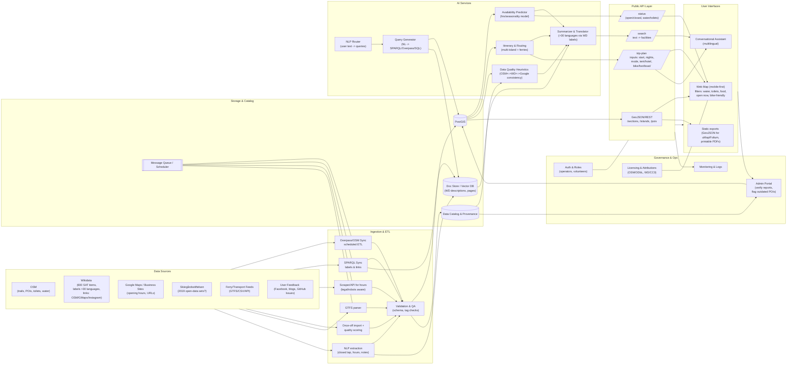

# Stockholm Archipelago Trail
* [SAT Dashboard](https://raw.githack.com/salgo60/Stockholm_Archipelago_Trail/main/notebook/output/SAT_ALL_IN_ONE_142_3_dashboard_latest.html)

# 🧭 Stockholm Archipelago Trail – En POC för framtidens vandringsledsdokumentation

Det här projektet är ett **proof of concept (POC)** för hur vandringsleder bör dokumenteras – inte med PDF:er och stängda appar, utan med **öppna data, länkade resurser och användarcentrerad design**.

## 💡 Syfte

Att visa hur man kan bygga en **datadriven, interoperabel och flerspråkig plattform** för friluftsliv – där användarnas behov styr vilka data som samlas in och hur de presenteras.

## 🔍 Så här gör vi idag vs. Så här borde vi göra

| 📉 Så här gör vi idag                              | 🚀 Så här borde vi göra                                      |
|----------------------------------------------------|--------------------------------------------------------------|
| PDF-filer, broschyrer, stängda appar               | Öppna, maskinläsbara format (GeoJSON, Wikidata, OSM)         |
| Fokus på kartan – inte på användaren               | Börja med användningsfall: vad behöver olika målgrupper?     |
| 290 kommuner gör egna lösningar                    | Nationell samordning med öppna standarder                    |
| Regler och info bara på svenska                    | Flerspråkigt via maskinöversättning och länkad data          |
| Ingen metadata om toaletter, vatten, grillplatser  | Kartlager med realtidsstatus, felanmälan och servicepunkter  |
| Kulturarv och naturdata separerade                 | Sammanlänkade via Wikidata, RAÄ, Commons                     |
| Bidrag till projekt som “känns bra”                | Finansiering av återanvändbar, transparent infrastruktur     |
| Ingen interoperabilitet                            | “Samma som”-länkning mellan Visit Sweden, OSM, Wikidata etc. |
| Ingen feedbackloop från användare                  | API för observationer, felanmälan, förbättringsförslag       |

## 🌍 Vision

Att skapa en **nationell modell för digital friluftsinfrastruktur** där data är lika viktig som stigen. SAT är en prototyp – men också ett manifest för hur det borde göras.

## 📦 Innehåll

- 🔗 Dashboard: [SAT_ALL_IN_ONE](https://raw.githack.com/salgo60/Stockholm_Archipelago_Trail/main/notebook/output/SAT_ALL_IN_ONE_142_3_dashboard_latest.html)
- 📁 Notebook: Datakopplingar, användningsfall, metadataförslag
- 🧪 Exempel: Hundägare, skolgrupper, digitala nomader, utländska turister
- 🧵 Diskussion: [Issue #234 – Så här borde vi göra](https://github.com/salgo60/Stockholm_Archipelago_Trail/issues/234)

## 🤝 Samarbete?

Detta är ett öppet projekt. Vill du bidra, återanvända eller diskutera vidare? Skapa en issue eller hör av dig!

---

> “Vi behöver en ny berättelse. En där friluftsliv är en del av den digitala infrastrukturen. En där data är lika viktig som stigen.”

----
  
A try to add value to Stockholm Archipelago Trail see [issues](https://github.com/salgo60/Stockholm_Archipelago_Trail/issues?q=is%3Aissue)
* see futher [Stockholm Archipelago Trail issues](https://github.com/salgo60/Stockholm_Archipelago_Trail/issues?q=is%3Aissue) and [Roslagsleden issues Roslagsleden](https://github.com/salgo60/Roslagsleden/issues?q=is%3Aissue)

# System Architecture see [issue 149](https://github.com/salgo60/Stockholm_Archipelago_Trail/issues/149)

## Binder with POC [video](https://youtu.be/bepljHYFqp4)

Click the badge to launch an interactive map in Binder 🚀

## Variant med snippets hur data kan hämtas från Wikidata OpenStreet Map
* [video](https://youtu.be/D02QFoozRvI)

TBA

## Variant med köra python kod och skapa översättningar mha Google Translate
* video TBD

## Tältplatser Naturreservat version 1 

## Resources
1) [Naturkartan](https://www.naturkartan.se/sv/) / [app](https://apps.apple.com/se/app/naturkartan/id1223011883)
2) [Grillplatser.nu](https://grillplatser.nu/Karta/Kommun/Stockholm)
2) Wikiproject
3) 
## Thoughts
